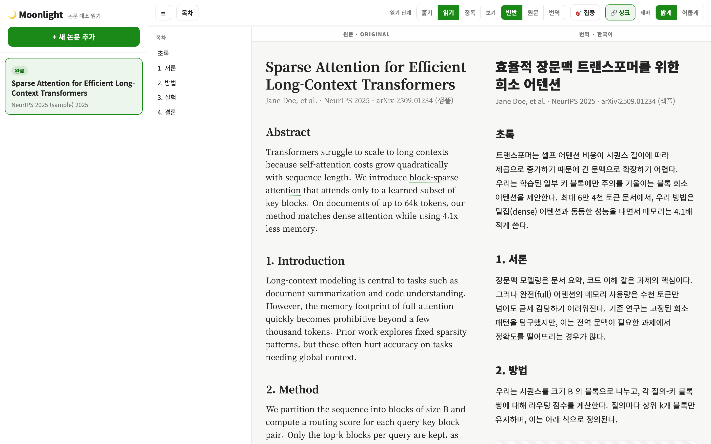

# 🌙 Moonlight

영어를 몰라도 논문을 편하게 읽는 **macOS 앱**. arXiv 논문을 한국어로 번역해
**좌측 원문 / 우측 한국어**로 나란히 보여주고, 한쪽 문장에 마우스를 올리면 반대편의
**대응 문장이 파란 형광펜**으로 강조된다. figure·table·수식은 양쪽에 그대로 유지.

> 참조: 기존 `claude-web-papers-kr`(번역 엔진을 그대로 계승). 자세한 설계는 `plans/` 참조.



## 빠른 시작 (사용자)
1. 이 레포를 clone.
2. 에이전트(claude)에게 **"설치해줘"** 라고 말한다 → `scripts/make-app.sh` 가 돌아
   `/Applications/claude-moonlight.app` 가 생긴다.
3. **`/Applications/claude-moonlight.app` 더블클릭** → 컨테이너가 자동 기동되고 뷰어가 열린다.

전제: 맥북에 **Docker Desktop**(실행 중)과 **로그인된 Claude CLI(`claude`)** 가 있어야 한다.
(앱 실행 시 Docker 가 꺼져 있으면 자동으로 켜기를 시도한다.)

## 동작 방식 (on-demand · 네이티브 앱)
앱은 브라우저가 아니라 **자체 창(WKWebView)** 으로 뜬다.
```
/Applications/claude-moonlight.app 실행 (네이티브 Swift/Cocoa 앱)
  → 앱 창에 "준비 중" 표시
  → scripts/ensure-up.sh
      · docker 데몬 확인(없으면 Docker Desktop 기동 시도)
      · 이미 떠 있으면 즉시 사용
      · 아니면 docker compose up -d → /api/health 대기
  → 준비되면 앱 창이 http://127.0.0.1:8090 을 로드
```
- **부팅 자동 시작 없음.** 앱을 켤 때만 컨테이너가 뜬다.
- **앱을 종료하면 컨테이너 + 호스트 워커가 함께 정지**(완전한 on-demand). 번역 도중 종료해도 다음 실행 때 자동 재개.
- 앱 본체는 `app/native/MoonlightApp.swift`(make-app.sh 가 swiftc 로 컴파일).

## 번역 엔진 (참조 레포 계승)
- 컨테이너 안 **PTY 인터랙티브 `claude`** 워커가 번역. **`claude -p` 금지.**
- 파이프라인: PDF 다운 → 페이지 읽기 → **문장 정렬 `paper.json`** 작성 → figure/table 추출 → 검증 → `DONE`.
- claude 인증은 호스트 `~/.claude` 를 컨테이너에 마운트해 공유(`docker-compose.yml`).

## 구조
| 경로 | 역할 |
|---|---|
| `app/server.py` | aiohttp 대시보드 서버(목록/추가/상태/정적, 샘플 프리로드) |
| `app/worker.py` | PTY 인터랙티브 claude 워커(번역 엔진, 참조 레포 계승) |
| `app/process_paper_prompt.md` | 파이프라인 지침(문장 정렬 paper.json 산출) |
| `app/validate_paper.py` | paper.json 스키마 검증 |
| `app/static/index.html` | 사이드바 + 2단 대조 뷰어(형광펜·집중·3-pass·테마·아웃라인·싱크) |
| `app/sample/paper.json` | 즉시 데모용 정렬 샘플 |
| `app/native/MoonlightApp.swift` | 네이티브 macOS 앱 창(WKWebView) 소스 |
| `Dockerfile`·`docker-compose.yml` | 컨테이너(서버+워커+poppler+claude) |
| `scripts/` | `make-app.sh`(앱 빌드)·`ensure-up.sh`(컨테이너 기동)·`moonlight-stop.sh`·`docker-entrypoint.sh` |
| `plans/` | v0.1~v0.3 설계 문서 · `materials/` 리서치·프로토타입·참조 코드 |

## 로컬 검증 (Docker 없이)
```bash
python3 -m venv .venv && ./.venv/bin/pip install -r requirements.txt
MOONLIGHT_DATA=./data ./.venv/bin/python app/server.py   # http://127.0.0.1:8090
```
서버만 띄워 뷰어/샘플을 확인할 수 있다(번역 워커는 claude+PTY 필요).

## 화면 사용법

### 사이드바 (왼쪽)
| 요소 | 동작 |
|---|---|
| **+ 새 논문 추가** | arXiv 링크·페이지 범위·설명 입력 → 번역 잡 생성(백그라운드 워커가 처리) |
| **논문 카드** | 클릭하면 뷰어로 열림. 번역 중이면 진행바·단계 표시 |
| **🗑 (카드 hover)** | 해당 논문 삭제 |

### 상단 탭 / 컨트롤 (왼→오른쪽)
| 탭 | 사용법 |
|---|---|
| **☰** | 사이드바 접기/펴기 (전체 폭으로 읽기) |
| **목차** | 좌측 아웃라인 패널 토글. 항목 클릭 시 **양쪽 패널이 같은 섹션으로** 점프 |
| **읽기 단계** | 본문 분량 조절 — **훑기**(초록·제목·결론만) / **읽기**(+본문·그림·표) / **정독**(+수식·세부 전부). [3-pass 독해법] |
| **보기** | **반반**(원문＋번역) / **원문**(영문만) / **번역**(한국어만) |
| **🎯 집중** | 가리킨 문장쌍만 또렷하게, 나머지는 흐리게 (몰입 읽기) |
| **🔗 싱크** | 좌우 스크롤 동기화 on/off (끄면 양쪽 독립 스크롤) |
| **테마** | **밝게** / **어둡게** |

### 본문에서
| 동작 | 결과 |
|---|---|
| 문장에 **마우스 올리기(hover)** | **양쪽의 같은 문장이 파란 형광펜**으로 강조 (가리킨 쪽 진하게 / 반대편 연하게) |
| 문장 **클릭** | 양쪽 패널을 그 문장 위치로 정렬 점프 |
| **점선 밑줄 용어**에 hover | 용어 설명 툴팁 (비원어민 어휘 보조) |
| 상단 **진행바** | 현재 읽기 위치(스크롤 진행률) |

> 팁: 처음 보는 논문은 **훑기 → 읽기 → 정독** 순으로, 모르는 문장은 hover 로 한국어를 바로 대조하세요.

## 한계 / 결정사항 (plans/v0.3.md §D, §G)
- 컨테이너 내 claude 인증이 매끄럽지 않으면 "앱=컨테이너 / 워커=호스트" 하이브리드로 전환(문서화됨).
- macOS 전용(PTY+fork+launchd 가정). 포트 8090(8080 은 claude-web-terminal 예약).
